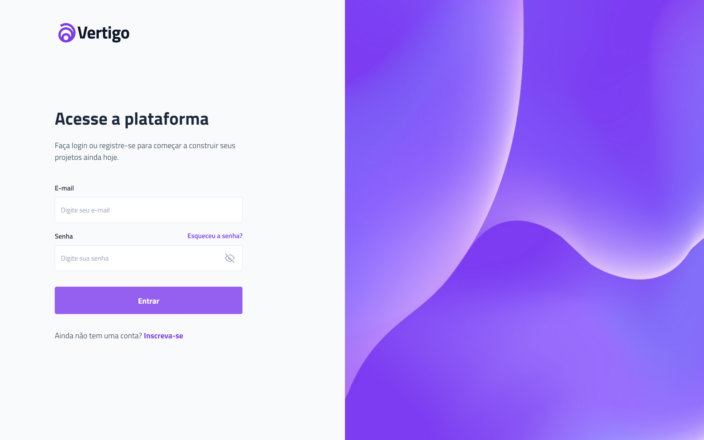

<h1 align="center"> Login Screen </h1>

[Click here to access](https://remng.github.io/login-screen/)

## 🚀 Technologies

This project was developed with the follow technologies:

- HTML
- CSS
- JavaScript
- Git and GitHub

## 💻 Project

A login screen that includes validations and a success message to indicate that the validation was successful.

Main features:

- Responsive layout (Adapted for smaller screens)
- Validations in input email and password
- Animation on input of success message
